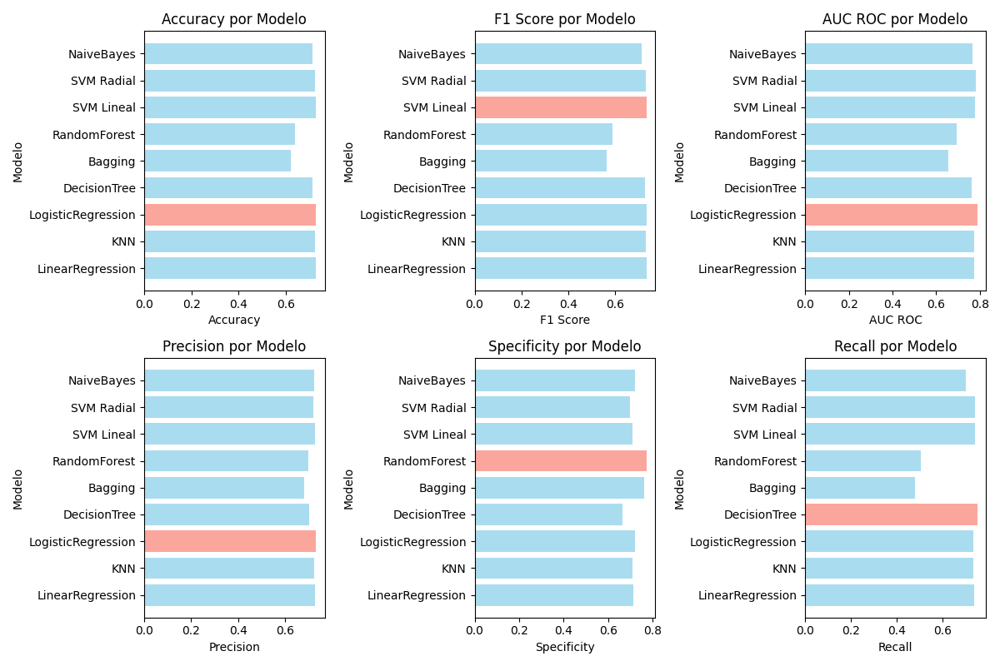

# FICO Credit Risk Prediction

## Overview

This machine learning project aims to predict the likelihood that an applicant will repay a Home Equity Line of Credit (HELOC) within two years, using a modified version of the FICO dataset.

The project includes:
- Exploratory Data Analysis (EDA)
- Supervised learning models (classification)
- Unsupervised learning techniques (dimensionality reduction and clustering)
- Model comparison and evaluation



## Key Features

* **Exploratory Data Analysis (EDA)**:
  - Dataset cleaning and preprocessing
  - Variable distribution analysis and class balance
  - Train-test data splitting

* **Classification Models**:
  - K-Nearest Neighbors
  - Logistic Regression
  - Decision Trees
  - Bagging and Random Forest
  - Scikit-Learn models
  - Evaluation metrics: Accuracy, F1-Score, Precision, ROC-AUC, and more

* **Unsupervised Learning**:
  - Principal Component Analysis (PCA)
  - Clustering algorithms: K-Means, Gaussian Mixture Models, Hierarchical

* **Model Comparison**:
  - Cross-validation
  - Performance analysis of each approach
  - Result visualization

## Repository Structure

```
FICO_MLModels_Project/
├── classification.py # Manual implementation of classification models
├── classification_models.py # Helper functions for classification
├── classification_sklearn.py # Scikit-Learn model implementation
├── models_comparison.py # Model performance comparison
├── data_analysis.py # EDA and preprocessing
├── unsupervised.py # PCA and clustering
├── unsupervised_tools.py # Utility functions for unsupervised learning
├── functions.py # General utilities
├── main.py # Console-based execution interface
├── requirements.txt # Python dependencies
├── Datasets/ # Cleaned data and metrics
├── FICO_Dataset.csv # Original dataset
├── Informe_ProyectoML_UlisesDiez.pdf # Final project report
└── README.md # This file

```

## Setup and Installation

1. **Clone the repository**

```bash
git clone https://github.com/Ulisesdz/FICO_MLModels_Project.git
cd FICO_MLModels_Project
```

2. **Install dependencies**

```bash
pip install -r requirements.txt
```

3. **Data Analysis**

```bash
python data_analysis.py
```

4. **Run the application** 

```bash
python main.py
```

## Usage
The script main.py provides a console menu for executing each part of the project:

Part 1: Data Analysis and Preprocessing
- Data cleaning
- Visualizations
- Train/test splitting

Part 2: Classification Models
- Manual models and Scikit-Learn implementation
- Model evaluation with various metrics

Part 3: Unsupervised Learning
- Dimensionality reduction (PCA)
- Clustering analysis

## Data Description
The dataset contains credit history features about applicants. Important variables include:
- ExternalRiskEstimate: Estimate of applicant risk
- NetFractionRevolvingBurden: Credit usage ratio
- PercentTradesNeverDelq: Percent of accounts never delinquent
- RiskPerformance: Target variable (0 = Good, 1 = Bad)

Special values:
- -9: No credit bureau record
- -8: Invalid or unusable data
- -7: Condition not met (e.g., no inquiries or delinquencies)

## License

This project is for educational purposes and was developed as part of a Machine Learning course at ICAI.

---